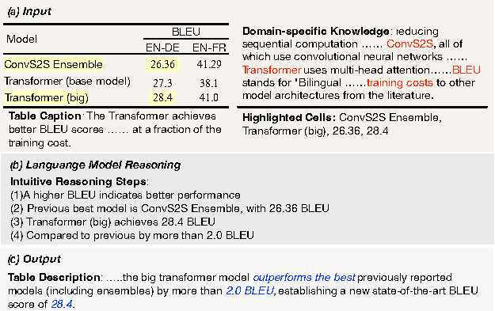

# CTRLSciTab
The CTRLSciTab dataset and code from ICASSP 2024 paper: Towards Controlled Table-to-Text Generation with Scientific Reasoning https://arxiv.org/pdf/2312.05402



## Dataset
CTRLSciTab, a specialized dataset in the scientific domain, comprises 8,967 pairs of tables and their corresponding descriptions. This dataset introduces a novel task: controlled table-to-text generation underpinned by scientific reasoning. The central objective of this task is to produce analytical narratives that not only adhere to the specific knowledge within a given domain but also align with predefined user preferences. It is anticipated that CTRLSciTab will provide a valuable benchmark for future research endeavors in the area of controlled table-to-text generation that incorporates scientific reasoning.

## Getting Started

### Requirements

```
pip install -r requirements.txt
```

## Dataset Description

## Train / Dev / Test Scripts
All relevant code is available in the 'Baselines' folder.

## Citation
If you find this project useful, please cite it using the following format:
```
@inproceedings{guo2024towards,
  title={Towards Controlled Table-to-Text Generation with Scientific Reasoning},
  author={Guo, Zhixin and Zhou, Jianping and Qi, Jiexing and Yan, Mingxuan and He, Ziwei and Zheng, Guanjie and Lin, Zhouhan and Wang, Xinbing and Zhou, Chenghu},
  booktitle={ICASSP 2024-2024 IEEE International Conference on Acoustics, Speech and Signal Processing (ICASSP)},
  pages={9951--9955},
  year={2024},
  organization={IEEE}
}
```


